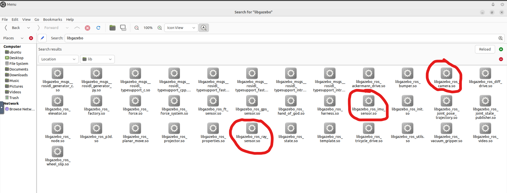
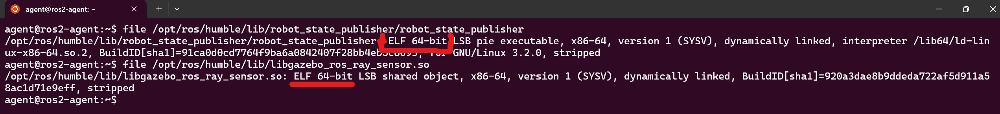

# Dummy Node Example

1. Start a Robot Instance
Run the script to initialize a robot with a specific name:
```bash
# Start robot1
./run_example.sh --name robot1

# Start robot2
./run_example.sh --name robot2
```

---

2. Execute Nodes

On `robot1`:

- **Python Publisher:**
```bash
ros2 launch py_example_package dummy_publisher.launch.py \
    namespace:=robot1 topic_name:=chatter message:="Hello from robot1!"
```

- **C++ Publisher:**
```bash
ros2 launch c_example_package dummy_publisher.launch.py \
    namespace:=robot1 topic_name:=chatter message:="Hello from robot1!"
```

**On `robot2`:**

- **Python Subscriber:**
```bash
ros2 run py_example_package dummy_subscriber --ros-args -p topic_name:=robot1/chatter
```

- **C++ Subscriber:**
```bash
ros2 run c_example_package dummy_subscriber --ros-args -p topic_name:=robot1/chatter
```

---

**Notes on Compiled Binaries**
- C++ binaries are located in:
```
~/ros2_ws/install/c_example_package/lib/c_example_package/
```
- These are built during the workspace compilation using:
```bash
colcon build
```

---

# TurtleBot3 Example Simulation

1. **Start the Gazebo Server**
   Launch the Gazebo simulation backend (physics engine, sensor updates, etc.):
   ```bash
   ros2 launch turtlebot3_gazebo gazebo_server.launch.py
   ```

2. **Start the Gazebo Client (GUI)**
   Launch the Gazebo GUI to visualize and interact with the simulation:
   ```bash
   ros2 launch turtlebot3_gazebo gazebo_client.launch.py
   ```

3. **Spawn the First Robot**
   Export the TurtleBot3 model and spawn the first robot in the simulation with a namespace (`robot1`):
   ```bash
   export TURTLEBOT3_MODEL=burger
   ros2 launch turtlebot3_gazebo robot.launch.py namespace:=robot1 x_pose:=0.0 y_pose:=0.0
   ```

4. **Spawn the Second Robot**
   Spawn a second robot with a different namespace (`robot2`) at a different position in the simulation:
   ```bash
   export TURTLEBOT3_MODEL=burger
   ros2 launch turtlebot3_gazebo robot.launch.py namespace:=robot2 x_pose:=2.0 y_pose:=0.0
   ```

5. **Control the First Robot**
   Use the `teleop_twist_keyboard` package to manually control `robot1` by sending velocity commands to its `/robot1/cmd_vel` topic:
   ```bash
   ros2 run teleop_twist_keyboard teleop_twist_keyboard cmd_vel:=/robot1/cmd_vel
   ```

 `/opt/ros/humble/lib/libgazebo_ros_ray_sensor.so`



