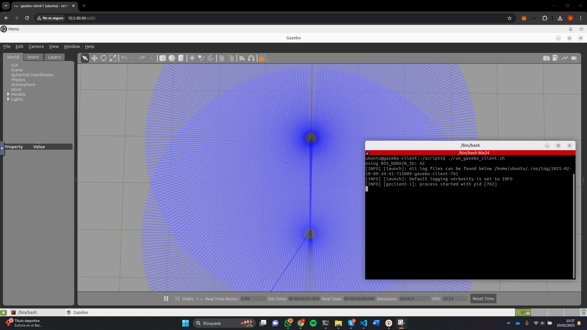

# Running the Gazebo Robot Simulation

## Start the Simulation
To launch the Gazebo robot simulator along with four (unspawned) robots, run:

```bash
docker compose up -d
```

This will:
- Start the Gazebo server.
- Deploy four robot containers without spawning them in the simulation.
- Launch a VNC container with the Gazebo client for graphical access via a web browser.

## Access the Gazebo Client
1. Environment variables are defined in the [.env](./.env) file.
2. Open a browser and navigate to: [http://10.5.99.99:6080](http://10.5.99.99:6080).
3. Open a terminal inside the VNC session and execute:
   ```bash
   ./run_gazebo_client.sh
   ```


## Spawn the Robot in Gazebo
1. Enter the robot container with the following command:
   ```bash
   docker exec -it <container_name> /bin/bash
   ```
2. Inside the container, launch the robot by running:
   ```bash  
   ./start_turtlebot.sh
   ```
This will spawn the robot in the Gazebo simulation using the [robot.launch.py](./dockerfiles/turtlebot3/ros2_ws/src/turtlebot3_simulations/turtlebot3_gazebo/launch/robot.launch.py) and the `namespace`, `x_pose` and `y_pose` values defined in the [.env](./.env) file.

## Stop the Simulation
To shut down the simulation and related containers, run:

```bash
docker compose down
```

## ROS Node for Remote Attestation
The C++ executable responsible for robot state publishing can be found at:

[robot_state_publisher.cpp](./dockerfiles/turtlebot3/ros2_ws/src/robot_state_publisher/src/robot_state_publisher.cpp)

This ROS node calculates and broadcasts the transforms (TF) of a robot's kinematic tree using its URDF model, enabling other nodes to understand the robot's structure and movement.
